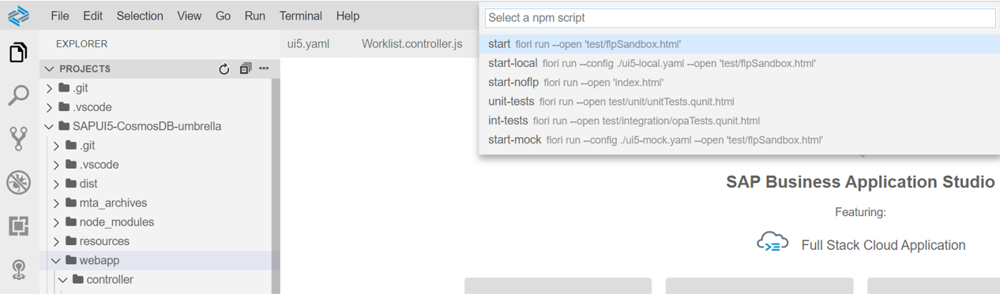

# cosmos-umbrella
A UI5 application to consume data from CosmosDB via OData.

Find the OData web api project [here](https://github.com/MartinPankraz/AzCosmosDB-OData-Shim) and the blog post on the SAP community [here]().

Find the public Azure DevOps project for insights on CI/CD [here](https://dev.azure.com/mapankra/CosmosDB%20OData%20SAP%20umbrella).


## Application Details
|               |
| ------------- |
|**Generation Date and Time**<br>Mon Jun 07 2021 12:40:58 GMT+0000 (Coordinated Universal Time)|
|**App Generator**<br>@sap/generator-fiori|
|**App Generator Version**<br>1.2.0|
|**Generation Platform**<br>SAP Business Application Studio|
|**Floorplan Used**<br>3worklistodatav4|
|**Service Type**<br>OData Url|
|**Service URL**<br>https://sap-cosmos-global.azurefd.net/api/odata
|**Module Name**<br>cosmos-umbrella|
|**Application Title**<br>SAPUI5-CosmosDB-umbrella|
|**Namespace**<br>azure.odata.cosmos.example|
|**UI5 Theme**<br>sap_fiori_3|
|**UI5 Version**<br>Latest|

## Starting the generated app

-   This app has been generated using the SAP Fiori tools - App Generator, as part of the SAP Fiori tools suite. In order to launch the generated app, simply right-click the webapp folder -> Preview application -> choose flp for Fiori launchpad env or noflp for Index.html only.

    
-   Alternatively run the following command from the Terminal from the generated app root folder:

```
    npm start
```

- It is also possible to run the application using mock data that reflects the OData Service URL supplied during application generation.  In order to run the application with Mock Data, run the following from the generated app root folder:

```
    npm run start-mock
```
The preview application option shows the mock commands too
